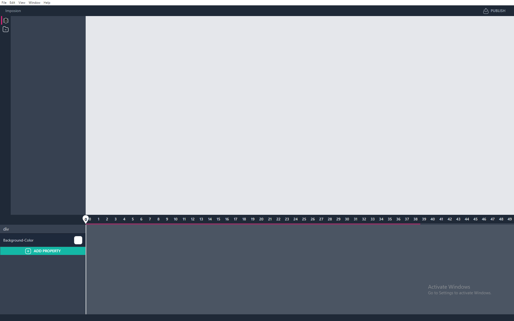

# Imposion ⚡

> Vite+Electron = 🔥

Animation editor for nex level websites

> Imposion first screen-shot

Ao compilar, deve se copiar os arquivos tailwind.config.js e postcss.config.js para a unidade renderer dentro de packages